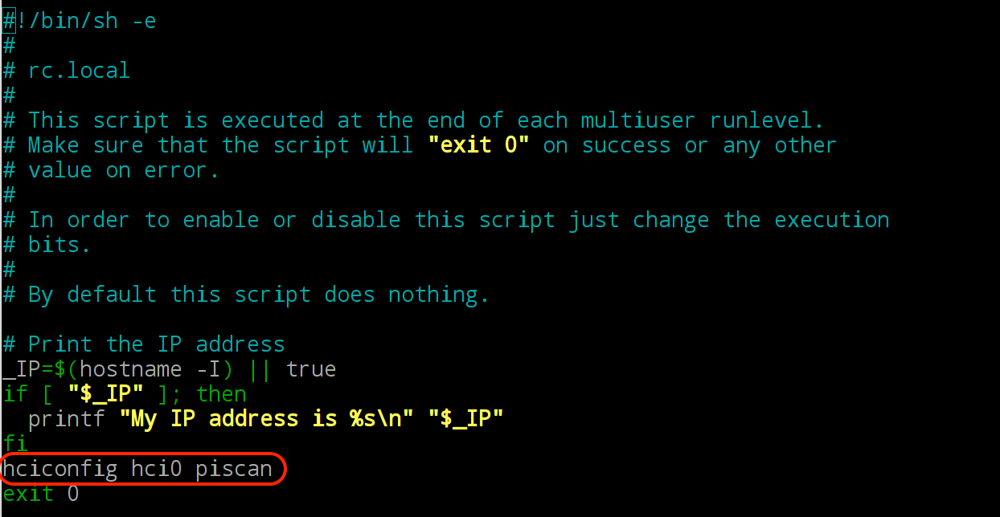
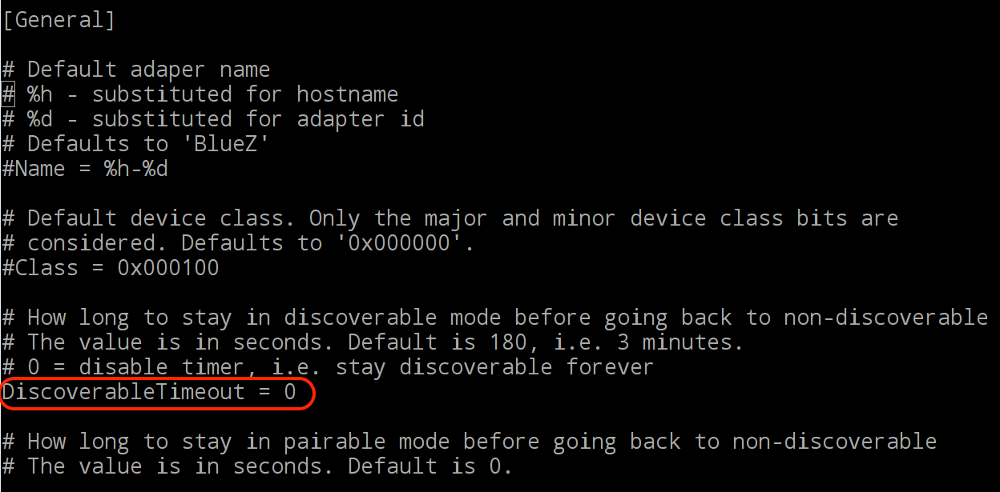

# Bluetooth-RPi-Python
A Python script running on Raspberry Pi 3 to receive commands (SSID & password) from / send executed results to an Android Device over bluetooth. Bluetooth-RPi-Python is used with this Android App: [Bluetooth-RPi](https://github.com/Yurockkk/Bluetooth-RPi) 

## Instruction

### Step 0 - Install the bluetooth softwares
Open terminal, install softwares:

`sudo apt-get update`

`sudo apt-get install bluez minicom`

`sudo apt-get install bluez-utils`

### Step 1 - Setup the SPP (serial port profile) 
Open terminal, edit this file

`sudo nano /etc/systemd/system/dbus-org.bluez.service`

Add `-C` at the end of the `ExecStart=` line, to start the bluetooth daemon in 'compatibility' mode. Add `ExecStartPost=/usr/bin/sdptool add SP` immediately after that line, to add the SP Profile. The two lines should look like this:

`ExecStart=/usr/lib/bluetooth/bluetoothd -C`

`ExecStartPost=/usr/bin/sdptool add SP`

### Step 2 - Save it and reboot your RPi

After rebooting your RPi, Open terminal and run this command to listen to discovery request from Android device:

`sudo rfcomm watch hci0`

Open another terminal and run the python code

`python2 /home/pi/DIRECTORY_TO_YOUR_PYTHON_CODE/bluetooth-RPi-wifi.py`

NOTE: make sure your RPi is in “discoverable” status or your Android device might not find it, you can do it by clicking “Make Discoverable()” in bluetooth interface


Now your RPi can be connected through bluetooth and receive commands (SSID & password) from / send executed results to the Android app: [Bluetooth-RPi](https://github.com/Yurockkk/Bluetooth-RPi)

## [OPTIONAL] Automating the Bluetooth Pairing Process

You can automating the bluetooth pairing process by taking the following steps

### Step 3 - Automatically listen to hci0 channel and run this python code
Create a new service unit file:

`sudo nano /etc/systemd/system/rfcomm.service`

Edit the file:
```
[Unit]
Description=RFCOMM service
After=bluetooth.service
Requires=bluetooth.service

[Service]	
ExecStart=/usr/bin/rfcomm watch hci0 &; /usr/bin/python2 /home/pi/DIRECTORY_TO_YOUR_PYTHON_CODE/bluetooth-RPi-wifi.py	

[Install]
WantedBy=multi-user.target

```

**NOTE:** There is only **one line of code** in **[Service]** section and there is a **space** between `bin/python2` and `/home`

Save it, Enable the service unit file:

`sudo systemctl enable rfcomm`

### Step 4 - Add the bash command `hciconfig hci0 piscan` in the file “/etc/rc.local” (before the last line of “exit 0”)

`sudo nano /etc/rc.local`



### Step 5 - Set the “discoverableTimeout” to “0” in the file “/etc/bluetooth/main.conf”
`sudo nano /etc/bluetooth/main.conf` 

(you can set the value to what ever you want your RPi to stay in discoverable mode)



### Step 6 - Reboot your RPi
Now, your RPi is able to be connected through bluetooth and receive commands (SSID & password) from / send executed results to the [Bluetooth-RPi](https://github.com/Yurockkk/Bluetooth-RPi) automatically

